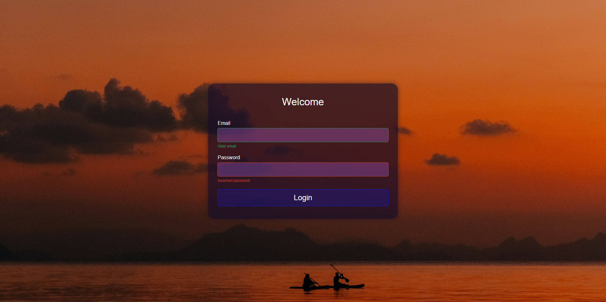

# CSS Login form

  

<em>Screenshot of the CSS Login form</em>

This project is a **learning project** based on a project by WebDevSimplified.  
The core concepts are derived from the original work.  
The implementation has been **slightly modified** for learning purposes, but most of the original structure and ideas remain intact.

## Learning Objectives

- Use of **CSS variables** for consistent theming
- **Flexbox** for layout and centering
- **Input validation styling** with success and error states

## Installation / Usage

1. Clone or download the repository
2. Open the `index.html`
3. Experiment with the CSS to reinforce your learning

## License

This project uses code derived from WebDevSimplified, which is licensed under the **MIT License © 2022 WebDevSimplified**.  
The full license is included in the `LICENSE` file.
